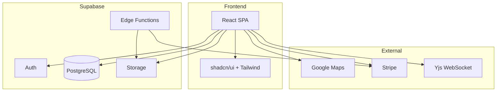

# Architecture

Technical stack, code structure, and main design decisions.

## Overview

Frontend: **React 18** with **TypeScript**, **Tailwind CSS**, and **shadcn/ui**. Backend and data: **Supabase** (PostgreSQL, Auth, Storage, Edge Functions). Deployment: **Vercel**.

## Frontend

| Technology | Use |
|------------|-----|
| React 18 | UI and routing |
| TypeScript | Static typing |
| Vite | Build and dev server |
| Tailwind CSS | Styling |
| shadcn/ui | Base components |
| Framer Motion | Animations |
| React Hook Form + Zod | Forms and validation |
| Recharts | Charts |
| Yjs + y-websocket | Real-time collaborative editing |
| i18next | Internationalization (ES/EN) |

## Backend and infrastructure

| Technology | Use |
|------------|-----|
| Supabase | BaaS: Auth, DB, Storage, Realtime |
| PostgreSQL | Database |
| PostGIS | Geospatial data |
| Supabase Edge Functions | Serverless logic (e.g. payments, email) |
| Stripe | Payments (visits, commissions) |

## Project structure

```
src/
├── components/   # UI by feature (auth, dashboards, negotiation, properties, chat, etc.)
├── hooks/        # Reusable logic (negotiation, visits, properties, etc.)
├── contexts/     # Auth, feature flags, etc.
├── services/     # External calls, document generation, etc.
├── lib/          # Supabase client, validation, repositories, utils
├── types/        # Types and entities
├── utils/        # Helpers
├── i18n/         # Translations
└── styles/       # Global styles
```

Routes and layout are defined in `Router` and layout components; auth and roles shape the menu and access.

## Database

- Normalized relational model. Migrations in `supabase/migrations/` (including consolidated ones).
- **Row Level Security (RLS)** on public tables. Policies restrict access by `auth.uid()` and role.
- Functions and triggers for offer validation, notifications, audit, and calculations (e.g. NPV).

See [Database — Schema](../reference/database/schema) and [RLS Policies](../reference/database/rls-policies).

## Integrations

- **Google Maps**: Maps, geocoding, and address for properties and visits.
- **Stripe**: Payment intents, webhooks, and payment status.
- **Yjs WebSocket**: Collaborative editing server; must be running in development when using the editor or real-time negotiation.

## Design decisions

- **Supabase as BaaS**: Speeds up Auth, DB, and Storage; less custom backend.
- **Strict RLS**: Authorization implemented at the data layer, not only in the UI.
- **Structured conditions and NPV**: Explicit model for offer conditions and value calculation. See [ADR-001](../decisions/adr-001-structured-conditions) and [ADR-002](../decisions/adr-002-npv-calculation).
- **Backward compatibility**: Migration strategy and feature flags for breaking changes. See [ADR-003](../decisions/adr-003-compatibility).

## High-level diagram



## Related

- [Quick Start](quick-start) — Environment setup
- [Concepts](concepts) — Domain model
- [Deployment](../operations/deployment) — Build and production
- [ADRs](../decisions/adr-001-structured-conditions) — Architecture decisions
