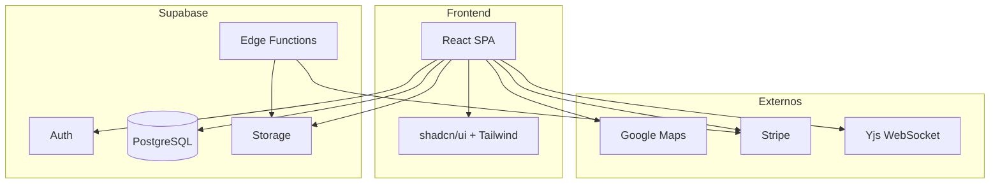

# Arquitectura

Stack técnico, estructura del código y decisiones de diseño principales.

## Resumen

Frontend en **React 18** con **TypeScript**, **Tailwind CSS** y **shadcn/ui**. Backend y datos en **Supabase** (PostgreSQL, Auth, Storage, Edge Functions). Despliegue en **Vercel**.

## Frontend

| Tecnología | Uso |
|------------|-----|
| React 18 | UI y enrutamiento |
| TypeScript | Tipado estático |
| Vite | Build y dev server |
| Tailwind CSS | Estilos |
| shadcn/ui | Componentes base |
| Framer Motion | Animaciones |
| React Hook Form + Zod | Formularios y validación |
| Recharts | Gráficos |
| Yjs + y-websocket | Edición colaborativa en tiempo real |
| i18next | Internacionalización (ES/EN) |

## Backend e infraestructura

| Tecnología | Uso |
|------------|-----|
| Supabase | BaaS: Auth, DB, Storage, Realtime |
| PostgreSQL | Base de datos |
| PostGIS | Datos geoespaciales |
| Supabase Edge Functions | Lógica serverless (p. ej. pagos, envío de email) |
| Stripe | Pagos (visitas, comisiones) |

## Estructura del proyecto

```
src/
├── components/     # UI por feature (auth, dashboards, negotiation, properties, chat, etc.)
├── hooks/          # Lógica reutilizable (negociación, visitas, propiedades, etc.)
├── contexts/       # Auth, feature flags, etc.
├── services/       # Llamadas externas, generación de documentos, etc.
├── lib/            # Supabase client, validaciones, repositorios, utils
├── types/          # Tipos y entidades
├── utils/          # Helpers
├── i18n/           # Traducciones
└── styles/         # Estilos globales
```

Las rutas y el layout se definen en `Router` y componentes de layout; la autenticación y los roles condicionan el menú y el acceso.

## Base de datos

- Modelo relacional normalizado. Migraciones en `supabase/migrations/` (incluidas las consolidadas).
- **Row Level Security (RLS)** en las tablas públicas. Las políticas restringen el acceso por `auth.uid()` y rol.
- Funciones y triggers para validación de ofertas, notificaciones, auditoría y cálculos (p. ej. VPN).

Véase [Base de datos — Esquema](../referencia/base-de-datos/esquema) y [Políticas RLS](../referencia/base-de-datos/politicas-rls).

## Integraciones relevantes

- **Google Maps**: Mapas, geocoding y dirección en propiedades y visitas.
- **Stripe**: Creación de intents, webhooks y estado de pagos.
- **Yjs WebSocket**: Servidor de edición colaborativa; debe estar en marcha en desarrollo cuando se use el editor o la negociación en tiempo real.

## Decisiones de diseño

- **Supabase como BaaS**: Acelera Auth, DB y Storage; menos operación de backend propio.
- **RLS estricto**: La autorización se implementa en la capa de datos, no solo en la UI.
- **Condiciones estructuradas y VPN**: Modelo explícito para condiciones de oferta y cálculo de valor. Ver [ADR-001](../decisiones/adr-001-condiciones-estructuradas) y [ADR-002](../decisiones/adr-002-calculo-vpn).
- **Compatibilidad hacia atrás**: Estrategia de migración y feature flags para cambios críticos. Ver [ADR-003](../decisiones/adr-003-compatibilidad).

## Diagrama de alto nivel



## Temas relacionados

- [Inicio rápido](inicio-rapido) — Configuración del entorno
- [Conceptos](conceptos) — Modelo de dominio
- [Despliegue](../operaciones/despliegue) — Build y producción
- [ADR](../decisiones/adr-001-condiciones-estructuradas) — Decisiones de arquitectura
